# How a Turn Moves Through the Game

Traces one request/response cycle in the backend — from a typed command, through
verb dispatch, to the state change and reply that come back. Sourced from
`backend/app/main.py`. Split into four diagrams so each stays legible; the
overview links out to the other three where the real branching happens.

## The loop

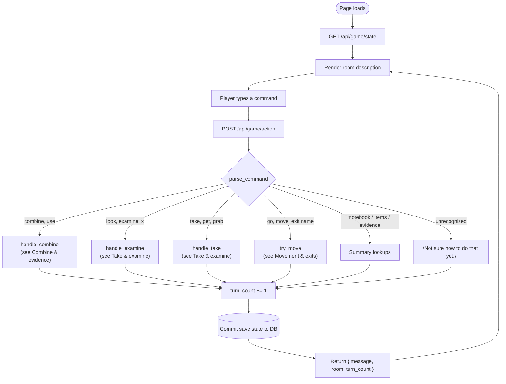

Dispatch lives at `backend/app/main.py:393-419`, summaries at `:328-345`.

## Movement & exits

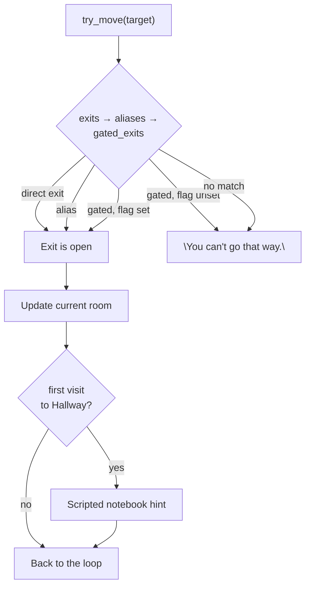

`backend/app/main.py:47-72`. Rooms form a hub-and-spoke graph (`rooms.py`);
one exit, Cellar → Tunnel, is gated behind the `wine_rack_open` flag.

## Take & examine

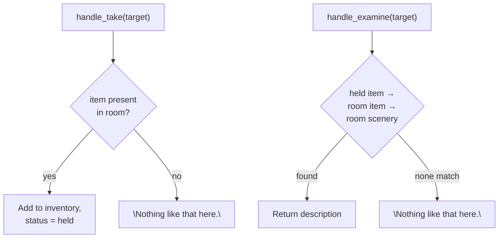

`backend/app/main.py:226-252`. Take and examine resolve against the same
three pools: held inventory, room items, then fixed room scenery.

## Combine & evidence

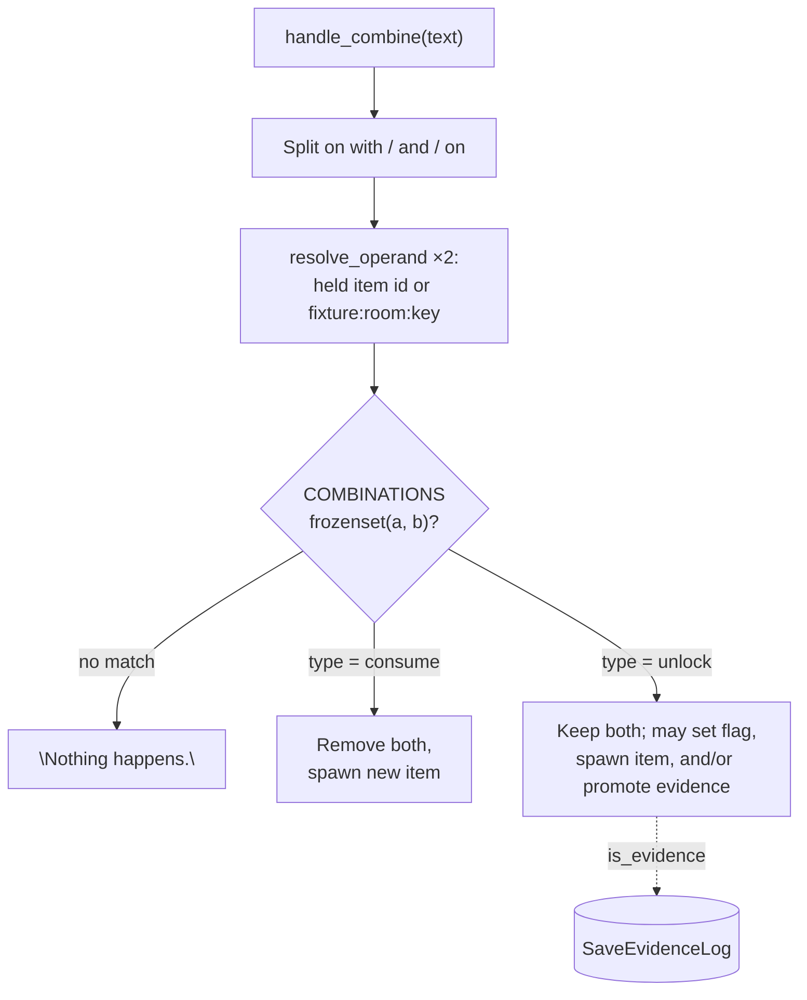

`backend/app/main.py:97-256`. This is the only puzzle mechanic: `consume`
combos burn both ingredients for a new item; `unlock` combos keep the
originals and can flip a flag or log evidence instead. There's no dialogue or
NPC system — "solving" the mystery means chaining combines that promote items
to evidence in the case file log.

## Room map

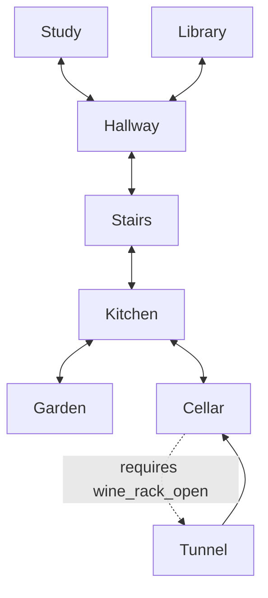

`backend/app/rooms.py`. Hub-and-spoke, not a straight chain: Hallway is the
upstairs hub (Study, Library, Stairs); Stairs bridges down to Kitchen, which
is the downstairs hub (Garden, Cellar). Cellar → Tunnel is the one gated
exit in the house — it stays blocked until the wine-rack combo below sets
`wine_rack_open`. The return trip, Tunnel → Cellar, is never gated.

## Items by room

Every takeable item, grouped by where it's found. Hallway, Stairs, and
Cellar were pure pass-throughs until a redistribution pass gave each of
them a find of their own (pulled out of Study/Kitchen/Library — see
`git show 6a7e877`); combining logic didn't change, since combos only care
about what's held, not where it started. Items with no room
(`room: None` in `items.py`) only exist after a combination spawns them —
listed separately at the bottom.

| Room | Item id | Name |
|---|---|---|
| Study | `candle_stub` | candle stub |
| Study | `ink_pad` | ink pad |
| Study | `magnifying_glass` | magnifying glass |
| Study | `window_glass_fragment` | glass shard |
| Study | `alibi_note` | alibi note |
| Study | `partial_fingerprint` | partial fingerprint |
| Study | `party_polaroid_dress` | dress polaroid |
| Hallway | `answering_machine_tape` | answering machine tape |
| Hallway | `party_guestbook` | guestbook |
| Hallway | `matchbook` | matchbook |
| Stairs | `party_polaroid_group` | group polaroid |
| Library | `tape_player` | tape player |
| Library | `photo_album_locked` | locked photo album |
| Library | `old_appraisal_letter` | appraisal letter |
| Library | `dumbwaiter_diagram` | dumbwaiter diagram |
| Kitchen | `broom_handle` | broom handle |
| Kitchen | `petty_cash_ledger` | petty cash ledger |
| Kitchen | `register_receipt` | receipt |
| Kitchen | `drink_glass` | drink glass |
| Kitchen | `kitchen_prep_schedule` | prep schedule |
| Cellar | `ledger_reconciliation_note` | reconciliation note |
| Cellar | `gambling_iou_note` | IOU note |
| Garden | `crank_handle_broken` | broken crank |
| Garden | `ornate_key` | ornate key |
| Garden | `blueprint_old` | old blueprint |

Non-takeable **scenery** doubles as a combine target via the
`fixture:<room>:<key>` operand form — only three fixtures are ever used that
way: `fixture:cellar:wine_rack`, `fixture:tunnel:passage`, and
`fixture:kitchen:hatch`.

**Spawned only** (produced by a combination, never found in a room):
`crank_jury_rigged`, `lit_candle`, `snagged_thread`, `childhood_photo`,
`fingerprint_lifted`, `timeline_note_kitchen`, `polaroid_dress_detail`.

## Evidence & combination chains

All 22 entries in `items.py`'s `COMBINATIONS`, grouped into the independent
chains they form. Each diagram reads: an item flows into a `+ other operand`
step, which either produces a new item, sets a flag, or promotes something
to evidence (`is_evidence` → logged in `SaveEvidenceLog`). A step marked
"requires" only fires once that flag is already set — combine it too early
and you get the combo's `not_ready_message` instead.

### Tunnel access

Not evidence itself — this chain is what gets you into the Tunnel at all.

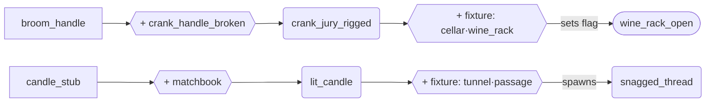

### The Niece — phone alibi

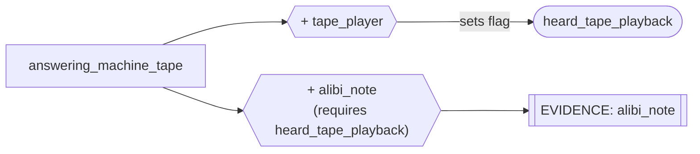

### The Niece — childhood photo

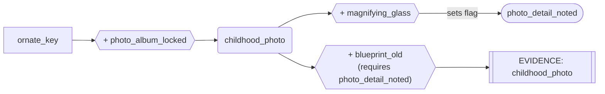

### The Niece — dress fabric match

`snagged_thread` here is the item the Tunnel Access chain spawns.
`party_polaroid_group`'s combo is a deliberately independent second path to
the same "opportunity" fact — it doesn't merge with the thread's promotion.

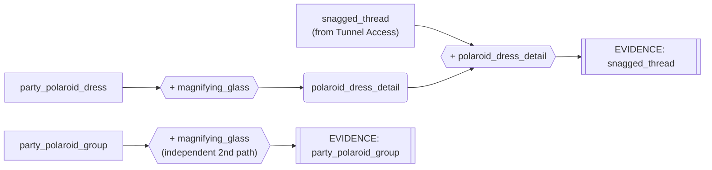

### The window — entry point

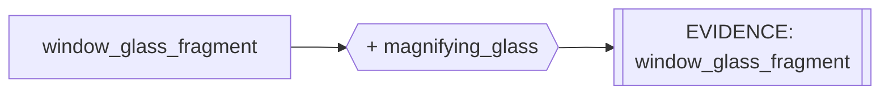

### The Butler — petty cash

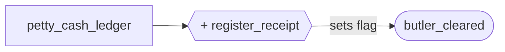

### The Family Friend — fingerprint

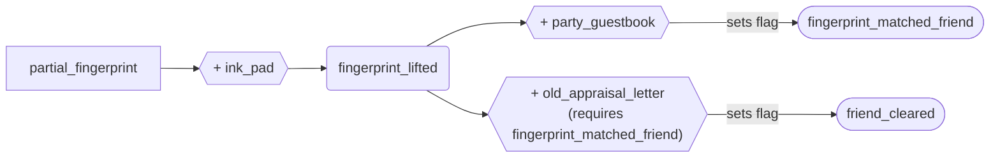

### The Son — drink timeline

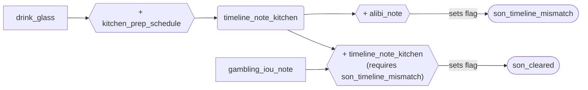

### The Cook & Butler — dumbwaiter

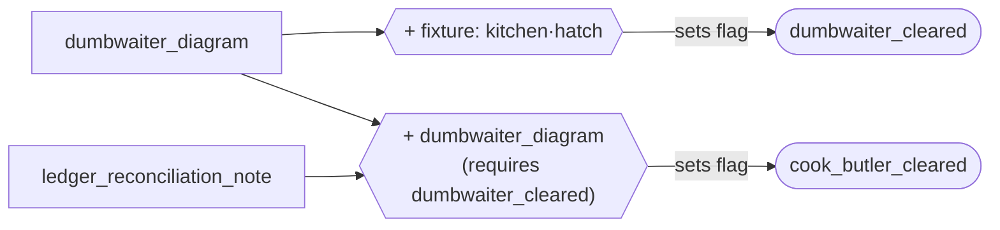

## What's not here yet

There's no win/lose state: `Save.status` defaults to `"in_progress"` and
nothing ever reads or changes it — an accusation/solution check is still
unbuilt. That's why these diagrams end at "reply," not at an ending. All the
`_cleared` and `_matched` flags above exist, but nothing yet reads them back
to decide whether the player's eventual accusation is correct.
